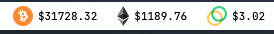

# Cryptocurrency widget

This is my attempt to keep track of my current cryptocurrency portfolio.
This widget is going to display the following information:
* Price of a coin in USD
* Current value of a coin in USD

## How to use this widget
In order to use this widget, edit `lib/config.js` with your [CoinMarketCap API](https://coinmarketcap.com/api/) key.

Works well with [simple-bar](https://github.com/Jean-Tinland/simple-bar).
